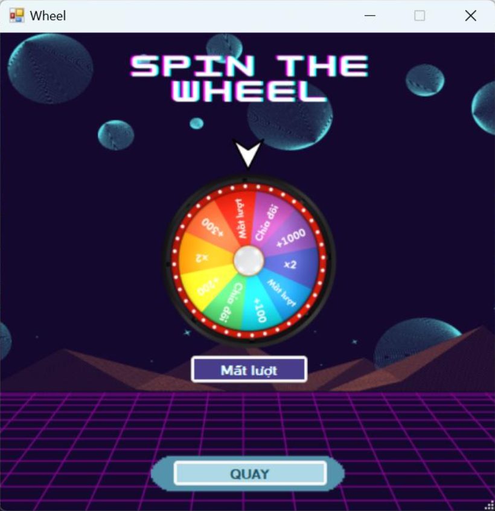

# 🎡 Lucky Wheel – Multiplayer Word Puzzle Game

Lucky Wheel is a networked multiplayer word puzzle game inspired by the classic TV show "Wheel of Fortune" (Vietnamese version "Chiếc nón kỳ diệu"). The game allows up to 3 players to compete in guessing letters to solve word puzzles across multiple rounds, with a spinning wheel that adds an element of chance to their score. This project was developed in C# as a basic network programming assignment, demonstrating socket programming and a simple client-server architecture.

<div align="center">
  
  
  
  
</div>

---

## 📖 Overview

In this game, players take turns spinning a lucky wheel to receive a random score or effect (such as losing a turn) and then guess a letter in a hidden phrase. Correct guesses reveal the letter in the puzzle and award points to the player; incorrect guesses or unlucky spins pass the turn to the next player. After a set number of rounds, the player with the highest total score wins. The game is implemented with a server coordinating the game logic and multiple client applications for each player, communicating via TCP sockets.

## ✨ Features

-   **🚪 Create and Join Game Rooms:** One player can host a game (creating a room) for others to join. The room supports up to 3 players. Other players can join by entering the host’s IP address.

-   **🖥️ User-Friendly GUI:** The game provides intuitive Windows Forms interfaces for:
    -   **Login:** Enter player name and server IP, with options to create or join a room.
    -   **Lobby:** Displays the list of connected players while waiting for the game to start.
    -   **Game Play:** Main screen showing the puzzle, hint, scores, and interactive alphabet buttons.
    -   **Wheel Spin:** A popup window with a spinning wheel graphic.
    -   **Results:** Screens to announce round completion and the final winner.

-   **🎮 Multiplayer Game Logic:**
    -   Turn-based letter guessing with a spinning wheel mechanic.
    -   Three rounds of play by default, with puzzles loaded from a JSON file.
    -   Scoring system based on the wheel’s value.
    -   Automated turn management. If a guess is correct, the same player continues their turn.
    -   The round ends when the puzzle is solved. The player with the highest total score wins.

-   **🌐 Real-time Network Communication:**
    -   Utilizes TCP socket networking to synchronize game state.
    -   The server broadcasts game updates (current turn, puzzle info, scores, etc.) to all players.
    -   Clients send player actions (joining, spinning, guessing) to the server.
    -   A defined message protocol ensures consistent data handling.

-   **🧵 Robust Design with Threads:**
    -   The server handles multiple clients simultaneously using multi-threading.
    -   The client application uses a background thread to listen for server messages, ensuring the GUI remains responsive.

## 🛠️ Technologies Used

-   **C# & .NET Framework:** The core language and platform for both client and server applications.
-   **WinForms (Windows Forms):** Used for building the graphical user interface.
-   **Socket Programming (`System.Net.Sockets`):** Enables TCP communication between the server and clients.
-   **Multi-threading:** To handle multiple connections and maintain a responsive UI.
-   **JSON:** For storing and loading questions and answers.
-   **Visual Studio 2022:** The integrated development environment for the project.

## 🚀 Getting Started

### Prerequisites

-   .NET Framework (or .NET 5+) and a Windows OS.
-   Visual Studio (2019 or later) to view/modify and build the project from source.

### Installation

1.  Clone or download this repository to your local machine.
    ```sh
    git clone [https://github.com/YOUR_USERNAME/YOUR_REPOSITORY.git](https://github.com/YOUR_USERNAME/YOUR_REPOSITORY.git)
    ```
2.  Open the solution file (`.sln`) in Visual Studio.
3.  Build the solution to restore any required packages and compile the code.

### How to Run

**1. Running the Server (as Host):**
-   Launch the client application and choose **"Create Room"**. This starts the server in the background.
-   The server UI window will open, prompting you to load the question file (JSON).

**2. Joining as a Player:**
-   Launch the client application.
-   Enter your player name and the host’s IP address.
-   Click **"Join Room"**. You will enter the lobby if successful.
-   Wait for the host to start the game.

### Gameplay

1.  When it’s your turn, click the **"Spin"** button.
2.  If you get a score, guess a letter by clicking one of the alphabet buttons.
3.  **Correct Guess:** The letter is revealed, you earn points, and you continue your turn.
4.  **Incorrect Guess / "Lose a Turn":** Your turn ends, and play passes to the next player.
5.  The game ends after the final round, and a winner screen displays the player with the highest score.

## 📸 Screenshots

*(Add your actual screenshots here by replacing the URLs)*

| Login Screen                                   | Game Lobby                                 | Gameplay Screen                                |
| ---------------------------------------------- | ------------------------------------------ | ---------------------------------------------- |
|    | |  |
| **Wheel Spin Popup** | **Winner Announcement** |                                                |
| |     |                                                |


## 👨‍💻 Authors / Credits

This game was developed as a networking course project by **Team 17, UIT**:

-   **Trần Phước Đại** – Developer (Socket integration, system design, UI logic, UI design)
-   **Lê Ngọc Kiều Anh** – Developer (UI design, game logic)
-   **Đồng Tài Đức** – Developer (Socket functions support)

Special thanks to the instructor **Đặng Lê Bảo Chương** for guidance and to the original "Chiếc nón kỳ diệu" game show for the inspiration.

## 📝 License

This project is licensed under the MIT License. See the `LICENSE` file for details.
